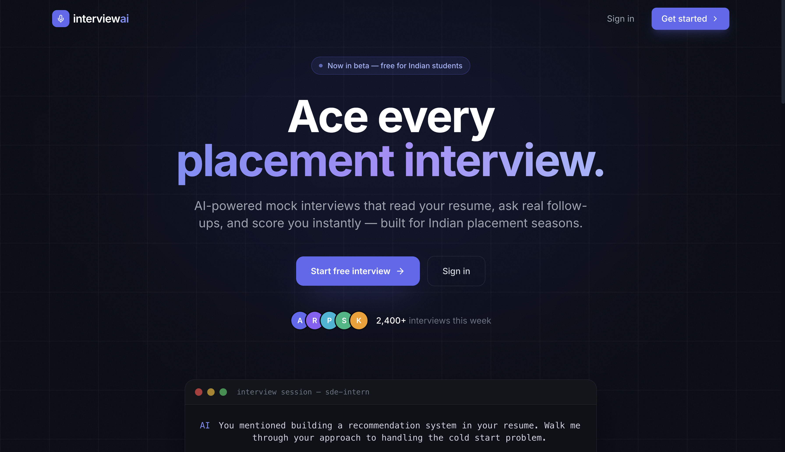
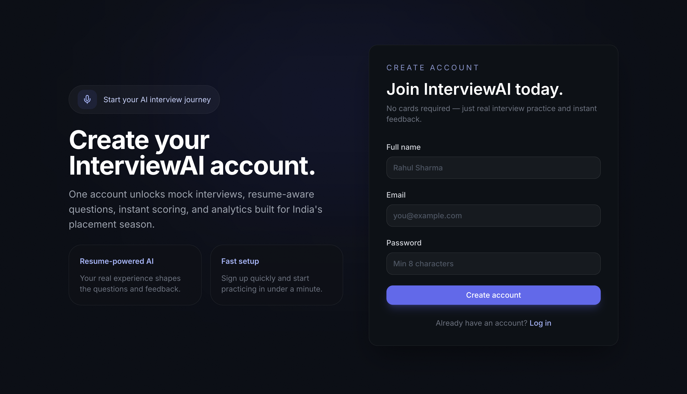
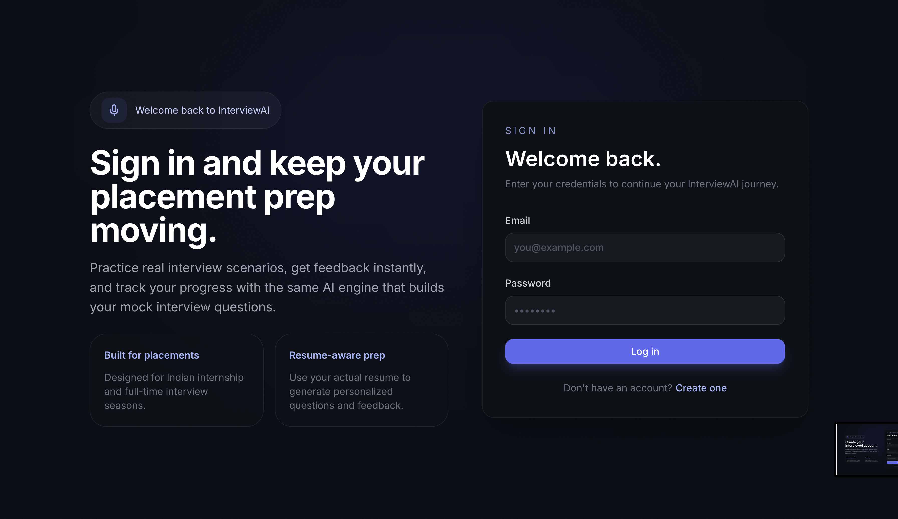
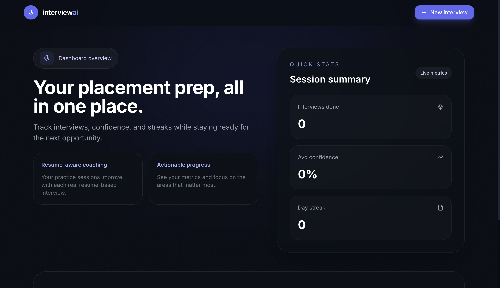
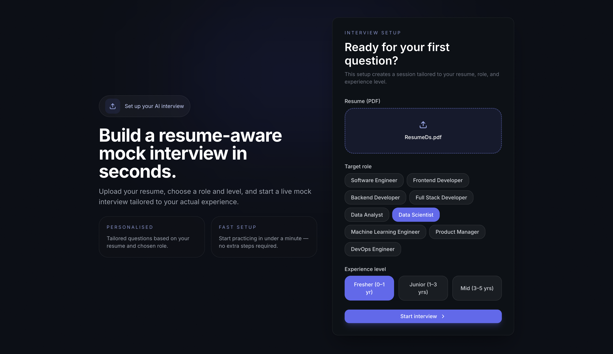

# InterviewAI-India

An AI-powered mock interview platform built for Indian students preparing for placements, internships, and competitive hiring processes. The platform simulates real interview experiences using Large Language Models, voice interaction, automated evaluation, and detailed performance reports.

---

## Application Screenshots

### Home Page



### Account Creation



### Sign In



### Placement Preparation Dashboard



### AI Mock Interview Interface



---

## Features

- AI-powered mock interviews
- Resume-based personalized questions
- Role-specific interview preparation
- Voice-based interaction
- Real-time speech-to-text transcription
- AI-generated follow-up questions
- Automated scoring and feedback
- Anti-cheating mechanisms
- Interview performance analytics
- Detailed candidate evaluation reports

---

## Technology Stack

| Layer | Technology |
|---------|------------|
| Frontend | Next.js 14, React, Tailwind CSS |
| Backend | FastAPI (Python) |
| Database | Supabase |
| Authentication | Supabase Auth |
| LLM | Groq API (Llama Models) |
| Speech-to-Text | Groq Whisper |
| Text-to-Speech | Browser Speech Synthesis API |
| Deployment | Vercel (Frontend), Render (Backend) |
| Version Control | Git & GitHub |

---

## Project Structure

```text
InterviewAI-India/
│
├── backend/
│   ├── app/
│   │   ├── api/
│   │   ├── services/
│   │   ├── models/
│   │   ├── core/
│   │   └── main.py
│   │
│   ├── requirements.txt
│   └── .env
│
├── frontend/
│   ├── src/
│   ├── public/
│   ├── package.json
│   └── .env.local
│
├── scrnsht/
│   ├── img1.png
│   ├── img2.png
│   ├── img3.png
│   ├── img4.png
│   └── img5.png
│
├── README.md
└── .gitignore
```

---

## Getting Started

### Prerequisites

- Python 3.11+
- Node.js 18+
- npm
- Git
- Groq API Key
- Supabase Project

---

# Backend Setup

Navigate to the backend folder:

```bash
cd backend
```

Create a virtual environment:

```bash
python -m venv venv
```

Activate the virtual environment:

### macOS / Linux

```bash
source venv/bin/activate
```

### Windows

```bash
venv\Scripts\activate
```

Install dependencies:

```bash
pip install -r requirements.txt
```

Create an environment file:

```bash
cp .env.example .env
```

Start the backend server:

```bash
uvicorn app.main:app --reload
```

Backend runs on:

```text
http://localhost:8000
```

---

# Frontend Setup

Navigate to frontend:

```bash
cd frontend
```

Install dependencies:

```bash
npm install
```

Create environment file:

```bash
cp .env.local.example .env.local
```

Start development server:

```bash
npm run dev
```

Frontend runs on:

```text
http://localhost:3000
```

---

## Environment Variables

### Backend (`backend/.env`)

```env
GROQ_API_KEY=your_groq_api_key

SUPABASE_URL=your_supabase_url

SUPABASE_SERVICE_KEY=your_supabase_service_role_key
```

### Frontend (`frontend/.env.local`)

```env
NEXT_PUBLIC_SUPABASE_URL=your_supabase_url

NEXT_PUBLIC_SUPABASE_ANON_KEY=your_supabase_anon_key

NEXT_PUBLIC_API_URL=http://localhost:8000
```

---

## Current Development Roadmap

### Completed

- Project Architecture
- Frontend Interface
- Backend API Structure
- Resume Upload Workflow
- AI Question Generation
- Voice Interview System
- Anti-Cheat Monitoring
- Session Management
- GitHub Collaboration Workflow

### In Progress

- Advanced Interview Reports
- Candidate Behaviour Analysis
- Communication Assessment
- Confidence Scoring
- Speech Quality Metrics
- Dashboard Analytics

### Planned

- CAT Preparation Mode
- FAANG-Specific Interview Tracks
- HR Interview Simulator
- System Design Interviews
- DSA Coding Interviews
- Company-Specific Question Banks
- Multi-Agent Interview Evaluation

---

## Contributors

| Name | Role |
|--------|------|
| Nikhil Singh | Developer |
| Harsh | Developer |

---

## Future Vision

InterviewAI-India aims to become a complete AI-driven interview preparation platform for Indian students preparing for:

- FAANG Companies
- Product-Based Companies
- Startups
- Campus Placements
- CAT Interviews
- MBA Admissions
- Technical Interviews
- HR Interviews
- Data Science Interviews
- Machine Learning Interviews

---

## License

This project is developed for educational and portfolio purposes.

---

## Repository

GitHub Repository:

https://github.com/tstnikhil4356/InterviewAI-India

